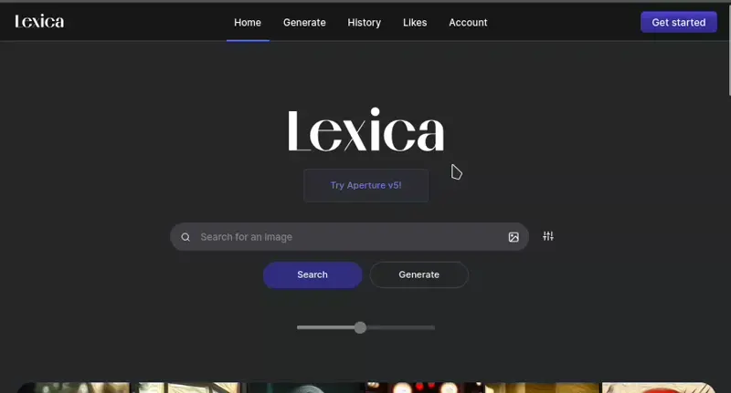

# Lexica clone

This project is a clone of lexica.art in react-JS with a backend to serve images.



## ⛏️ Built with

- **Vite**: A fast, opinionated build tool for modern web development.
- **React**: For the frontend.
- **NodeJS**: For the backend server.

## 🗃️ Features

- A simple JSON based API to serve images
- Mobile view

## 🔧 Setup

1. **Clone the repo and install dependencies in the client, server, and project's root folders**

```bash
git clone https://github.com/setAutomata/lexica.art-clone.git
cd lexica.art-clone/ && npm i
cd client && npm i
cd ../server && npm i
```

2. **You can Run the app from the project's root folder as:**

```bash
npm start
```

**OR** start the client and server separately by running the following command in each folder:

```
npm run dev
```

N.B You can go to the docs page using http://localhost:5173/docs

## Live Demo

[click here to preview](https://setautomata.github.io/lexica.art-clone/)
